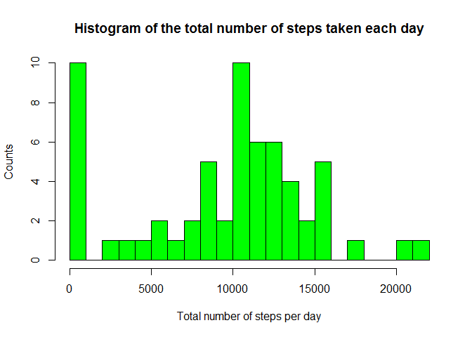
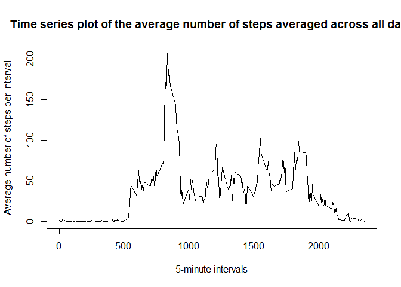
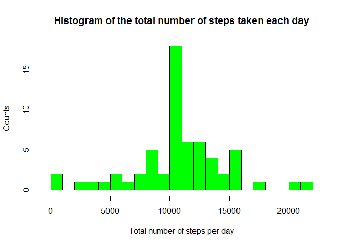
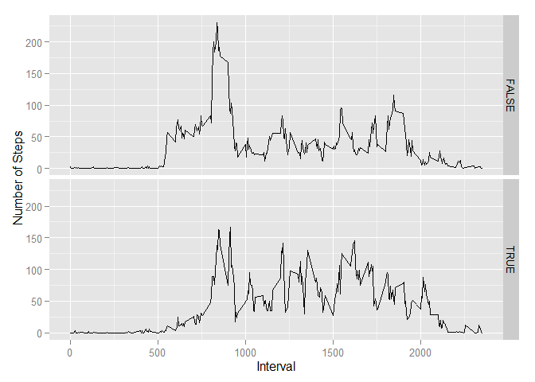

# Reproducible Research: Peer Assessment 1
Hovhannes Khandanyan  

### Loading Necessary R Packages


```r
library("tidyr")
library("dplyr")
```

```
## 
## Attaching package: 'dplyr'
## 
## The following object is masked from 'package:stats':
## 
##     filter
## 
## The following objects are masked from 'package:base':
## 
##     intersect, setdiff, setequal, union
```

```r
library("xtable")
```

```
## Warning: package 'xtable' was built under R version 3.1.3
```

```r
library("chron")
```

```
## Warning: package 'chron' was built under R version 3.1.3
```

```r
library("ggplot2")
```

## Loading and preprocessing the data

```r
df<-read.csv("C:/Users/U003HXK/Documents/ReproducibleResearch/Week2/activity.csv")
xt<-xtable(summary(df))
print(xt, type="html")
```

<!-- html table generated in R 3.1.2 by xtable 1.7-4 package -->
<!-- Fri May 15 18:31:52 2015 -->
<table border=1>
<tr> <th>  </th> <th>     steps </th> <th>         date </th> <th>    interval </th>  </tr>
  <tr> <td align="right"> 1 </td> <td> Min.   :  0.00   </td> <td> 2012-10-01:  288   </td> <td> Min.   :   0.0   </td> </tr>
  <tr> <td align="right"> 2 </td> <td> 1st Qu.:  0.00   </td> <td> 2012-10-02:  288   </td> <td> 1st Qu.: 588.8   </td> </tr>
  <tr> <td align="right"> 3 </td> <td> Median :  0.00   </td> <td> 2012-10-03:  288   </td> <td> Median :1177.5   </td> </tr>
  <tr> <td align="right"> 4 </td> <td> Mean   : 37.38   </td> <td> 2012-10-04:  288   </td> <td> Mean   :1177.5   </td> </tr>
  <tr> <td align="right"> 5 </td> <td> 3rd Qu.: 12.00   </td> <td> 2012-10-05:  288   </td> <td> 3rd Qu.:1766.2   </td> </tr>
  <tr> <td align="right"> 6 </td> <td> Max.   :806.00   </td> <td> 2012-10-06:  288   </td> <td> Max.   :2355.0   </td> </tr>
  <tr> <td align="right"> 7 </td> <td> NA's   :2304   </td> <td> (Other)   :15840   </td> <td>  </td> </tr>
   </table>


## What is mean total number of steps taken per day?


```r
daylySummary<-df %>% group_by_(~date) %>% summarise_(totalStepsPerDay=~sum(steps,na.rm = TRUE), NofDays=~n())
hist(daylySummary$totalStepsPerDay,breaks=25,col="green",main="Histogram of the total number of steps taken each day",xlab="Total number of steps per day",ylab="Counts")
```

 

```r
meanTotalNofStepsPerDay<-mean(daylySummary$totalStepsPerDay,na.rm = TRUE)
medianTotalNofStepsPerDay<-median(daylySummary$totalStepsPerDay,na.rm = TRUE)
```

Mean of the total number of steps taken per day: 9354.2295082.

Median of the total number of steps taken per day: 10395.

## What is the average daily activity pattern?


```r
intervalSummary<-df %>% group_by_(~interval) %>% 
    summarise_(totalStepsPerInterval=~sum(steps,na.rm = TRUE), 
               averageStepsPerInterval=~mean(steps,na.rm = TRUE),
               NofIntervals=~n())
plot(x = intervalSummary$interval,y=intervalSummary$averageStepsPerInterval,type = "l",
     main="Time series plot of the average number of steps averaged across all days",
     xlab="5-minute intervals",
     ylab="Average number of steps per interval")
```

 

```r
maxInterval<-intervalSummary$interval[which.max(intervalSummary$averageStepsPerInterval)]
```

The 5-minute interval that on average across all the days in the dataset, contains 
the maximum number of steps: 835.


## Imputing missing values

```r
missingValues<-sum(!complete.cases(df))
```

Number of missing values in the dataset: 2304.

***The strategy for filling in all of the missing values in the dataset: substitute by the  mean for that 5-minute interval***.

In order to replace **NA** values with interval averages, first notice that interval cicle consists of 288 items. This is because 288x5 min  = 24 hours. Hence, let us take the indices of *step* variable with NA value and build indices of corresponding *averaged step* values based on 288 interval cicle. Keep in mind that indexing starts at 1 not at zero.


```r
indexNA<-which(is.na(df$steps))
replacementIndex<-indexNA %% 288
replacementIndex[replacementIndex==0]<-288
correctedDF<-df
correctedDF$steps[indexNA]<-intervalSummary$averageStepsPerInterval[replacementIndex]
```


Recompute daily averaged statistics based on adjusted data. 

```r
daylySummaryCorr<-correctedDF %>% group_by_(~date) %>% summarise_(totalStepsPerDay=~sum(steps,na.rm = TRUE), NofDays=~n())
hist(daylySummaryCorr$totalStepsPerDay,breaks=25,col="green",main="Histogram of the total number of steps taken each day",xlab="Total number of steps per day",ylab="Counts")
```

 

```r
meanTotalNofStepsPerDayCorr<-mean(daylySummaryCorr$totalStepsPerDay,na.rm = TRUE)
medianTotalNofStepsPerDayCorr<-median(daylySummaryCorr$totalStepsPerDay,na.rm = TRUE)
```

Mean of the total number of steps taken per day after adjusting for NA values: 1.0766\times 10^{4}.

Median of the total number of steps taken per day after adjusting for NA values: 1.0766189\times 10^{4}.

***Yes, we observe that both median and mean values icreased. This is due to replacing NA values with corresponding averages, where the former was initially defaulted to zero. For those days with NA intervals, total daily number of steps has increased as well.***

## Are there differences in activity patterns between weekdays and weekends?


```r
correctedDF<- correctedDF %>% mutate_(Weekday=~weekdays(as.Date(correctedDF$date)), 
                                      IsWeekEnd=~chron::is.weekend(as.Date(correctedDF$date)))
WEintervalSummary<-correctedDF %>% group_by_(~interval,~IsWeekEnd) %>% 
    summarise_(totalStepsPerInterval=~sum(steps,na.rm = TRUE), 
               averageStepsPerInterval=~mean(steps,na.rm = TRUE),
               NofIntervals=~n())

ggplot(data = WEintervalSummary,aes(interval,averageStepsPerInterval)) + geom_line() + facet_grid(IsWeekEnd ~.) +xlab("Interval")+ylab("Number of Steps")
```

 

